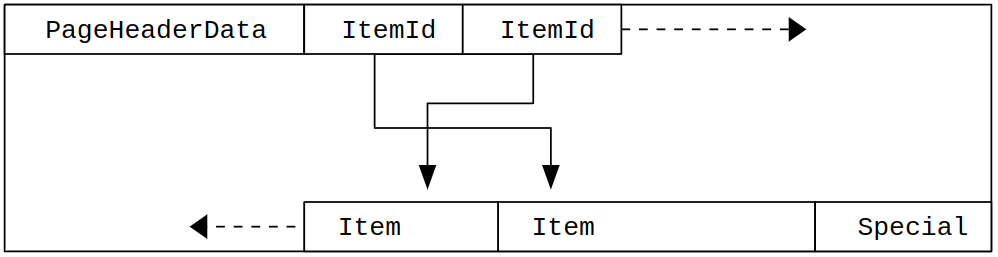

# Disk storage details

**Note**: every variable starting with **_pg__** or **_pg_** (and other variants) is replaced with **_ks__**. e.g.: _pg_logical_ will be _ks_logical_.

**Table of content**:
<!-- TOC -->
* [Disk storage details](#disk-storage-details)
  * [73.1. Database File Layout](#731-database-file-layout)
  * [Table 73.1. Contents of PGDATA](#table-731-contents-of-pgdata)
  * [73.3. Free Space Map](#733-free-space-map)
  * [73.4. Visibility Map](#734-visibility-map)
  * [73.5. The Initialization Fork](#735-the-initialization-fork)
  * [73.6. Database Page Layout](#736-database-page-layout)
      * [Table 73.2. Overall Page Layout](#table-732-overall-page-layout)
      * [Table 73.3. PageHeaderData Layout](#table-733-pageheaderdata-layout)
      * [Figure 73.1. Page Layout](#figure-731-page-layout)
      * [73.6.1. Table Row Layout](#7361-table-row-layout)
<!-- TOC -->

## 73.1. Database File Layout

[Source](https://www.postgresql.org/docs/16/storage-file-layout.html)

This section describes the storage format at the level of files and directories.

Traditionally, the configuration and data files used by a database cluster are stored together within the cluster's data directory,
commonly referred to as `PGDATA` (after the name of the environment variable that can be used to define it). A common location for
`PGDATA` is `/var/lib/pgsql/data`. Multiple clusters, managed by different server instances, can exist on the same machine.

The `PGDATA` directory contains several subdirectories and control files, as shown in [Table 73.1.](#table-731-contents-of-pgdata)
In addition to these required items, the cluster configuration files `postgresql.conf`, `pg_hba.conf`, and `pg_ident.conf` are traditionally
stored in `PGDATA`, although it is possible to place them elsewhere.

## Table 73.1. Contents of PGDATA

| Item                 | Description                                                                                                                                                                                                                                                                                                                                            |
|:---------------------|:-------------------------------------------------------------------------------------------------------------------------------------------------------------------------------------------------------------------------------------------------------------------------------------------------------------------------------------------------------|
| PG_VERSION           | A file containing the major version number of PostgreSQL                                                                                                                                                                                                                                                                                               |
| base                 | Subdirectory containing per-database subdirectories                                                                                                                                                                                                                                                                                                    |
| current_logfiles     | File recording the log file(s) currently written to by the logging collector                                                                                                                                                                                                                                                                           |
| global               | Subdirectory containing cluster-wide tables, such as pg_database                                                                                                                                                                                                                                                                                       |
| pg_commit_ts         | Subdirectory containing transaction commit timestamp data                                                                                                                                                                                                                                                                                              |
| pg_dynshmem          | Subdirectory containing files used by the dynamic shared memory subsystem                                                                                                                                                                                                                                                                              |
| pg_logical           | Subdirectory containing status data for logical decoding                                                                                                                                                                                                                                                                                               |
| pg_multixact         | Subdirectory containing multitransaction status data (used for shared row locks)                                                                                                                                                                                                                                                                       |
| pg_notify            | Subdirectory containing LISTEN/NOTIFY status data                                                                                                                                                                                                                                                                                                      |
| pg_replslot          | Subdirectory containing replication slot data                                                                                                                                                                                                                                                                                                          |
| pg_serial            | Subdirectory containing information about committed serializable transactions                                                                                                                                                                                                                                                                          |
| pg_snapshots         | Subdirectory containing exported snapshots                                                                                                                                                                                                                                                                                                             |
| pg_stat              | Subdirectory containing permanent files for the statistics subsystem                                                                                                                                                                                                                                                                                   |
| pg_stat_tmp          | Subdirectory containing temporary files for the statistics subsystem                                                                                                                                                                                                                                                                                   |
| pg_subtrans          | Subdirectory containing subtransaction status data                                                                                                                                                                                                                                                                                                     |
| pg_tblspc            | Subdirectory containing symbolic links to tablespaces                                                                                                                                                                                                                                                                                                  |
| pg_twophase          | Subdirectory containing state files for prepared transactions                                                                                                                                                                                                                                                                                          |
| pg_wal               | Subdirectory containing WAL (Write Ahead Log) files                                                                                                                                                                                                                                                                                                    |
| pg_xact              | Subdirectory containing transaction commit status data                                                                                                                                                                                                                                                                                                 |
| postgresql.auto.conf | A file used for storing configuration parameters that are set by ALTER SYSTEM                                                                                                                                                                                                                                                                          |
| postmaster.opts      | A file recording the command-line options the server was last started with                                                                                                                                                                                                                                                                             |
| postmaster.pid       | A lock file recording the current postmaster process ID (PID), cluster data directory path, postmaster start timestamp, port number, Unix-domain socket directory path (could be empty), first valid listen_address (IP address or *, or empty if not listening on TCP), and shared memory segment ID (this file is not present after server shutdown) |

**Note**: In my implementation, I don't think we need to use most of these directories, but they are here for reference.

For each database in the cluster there is a subdirectory within `PGDATA/base`, named after the database's OID in `pg_database`. This subdirectory is the default
location for the database's files; in particular, its system catalogs are stored there.
Note that the following sections describe the behavior of the builtin heap table access method, and the builtin index access methods. Due to the extensible
nature of PostgreSQL, other access methods might work differently.
Each table and index is stored in a separate file. For ordinary relations, these files are named after the table or index's filenode number, which can be found
in `pg_class.relfilenode`. But for temporary relations, the file name is of the form t`BBB_FFF`, where `BBB` is the backend ID of the backend which created the file,
and `FFF` is the filenode number. In either case, in addition to the main file (a/k/a main fork), each table and index has a free space map (see [Section 73.3](#733-free-space-map)),
which stores information about free space available in the relation. The free space map is stored in a file named with the filenode number plus the suffix `_fsm`.
Tables also have a visibility map, stored in a fork with the suffix `_vm`, to track which pages are known to have no dead tuples. The visibility map is described
further in [Section 73.4](#734-visibility-map). Unlogged tables and indexes have a third fork, known as the initialization fork, which is stored in a fork with the
suffix `_init` (see [Section 73.5](#735-the-initialization-fork)).

**Caution**:
Note that while a table's filenode often matches its OID, this is not necessarily the case; some operations, like **TRUNCATE**, **REINDEX**, **CLUSTER** and some forms of
**ALTER TABLE**, can change the filenode while preserving the OID. Avoid assuming that filenode and table OID are the same. Also, for certain system catalogs including
**pg_class** itself, **pg_class.relfilenode** contains zero. The actual filenode number of these catalogs is stored in a lower-level data structure, and can be obtained
using the **pg_relation_filenode()** function.

When a table or index exceeds 1 GB, it is divided into gigabyte-sized segments. The first segment's file name is the same as the filenode; subsequent segments are named
filenode.1, filenode.2, etc. This arrangement avoids problems on platforms that have file size limitations. (Actually, 1 GB is just the default segment size. The segment
size can be adjusted using the configuration option `--with-segsize` when building PostgreSQL.) In principle, free space map and visibility map forks could require multiple
segments as well, though this is unlikely to happen in practice.
A table that has columns with potentially large entries will have an associated _TOAST_ table, which is used for out-of-line storage of field values that are too large to
keep in the table rows proper. pg_class.reltoastrelid links from a table to its TOAST table, if any. See Section 73.2 for more information.
The contents of tables and indexes are discussed further in [Section 73.6](#736-database-page-layout).
Tablespaces make the scenario more complicated. Each user-defined tablespace has a symbolic link inside the `PGDATA/pg_tblspc` directory, which points to the physical
tablespace directory (i.e., the location specified in the tablespace's `CREATE TABLESPACE` command). This symbolic link is named after the tablespace's OID. Inside the
physical tablespace directory there is a subdirectory with a name that depends on the PostgreSQL server version, such as `PG_9.0_201008051`.
(The reason for using this subdirectory is so that successive versions of the database can use the same `CREATE TABLESPACE` location value without conflicts.) Within the
version-specific subdirectory, there is a subdirectory for each database that has elements in the tablespace, named after the database's OID. Tables and indexes are stored
within that directory, using the filenode naming scheme. The `pg_default` tablespace is not accessed through `pg_tblspc`, but corresponds to `PGDATA/base`. Similarly,
the pg_global tablespace is not accessed through `pg_tblspc`, but corresponds to `PGDATA/global`.
The `pg_relation_filepath()` function shows the entire path (relative to `PGDATA`) of any relation. It is often useful as a substitute for remembering many of the above rules.
But keep in mind that this function just gives the name of the first segment of the main fork of the relation — you may need to append a segment number and/or `_fsm`,` _vm`,
or `_init` to find all the files associated with the relation.
Temporary files (for operations such as sorting more data than can fit in memory) are created within `PGDATA/base/pgsql_tmp`, or within a `pgsql_tmp` subdirectory of a
tablespace directory if a tablespace other than `pg_default` is specified for them. The name of a temporary file has the form `pgsql_tmpPPP.NNN`, where `PPP` is the PID of
the owning backend and `NNN` distinguishes different temporary files of that backend.

## 73.3. Free Space Map

[Source](https://www.postgresql.org/docs/16/storage-fsm.html)

**Note**: this section is temporarily and is prune to change after my database implementation and design is somewhat finalized.

Each heap and index relation, except for hash indexes, has a Free Space Map (FSM) to keep track of available space in the relation.
It's stored alongside the main relation data in a separate relation fork, named after the filenode number of the relation,
plus a `_fsm` suffix. For example, if the filenode of a relation is 12345, the FSM is stored in a file called `12345_fsm`,
in the same directory as the main relation file.
The Free Space Map is organized as a tree of FSM pages. The bottom level FSM pages store the free space available on each heap (or index) page,
using one byte to represent each such page. The upper levels aggregate information from the lower levels.
Within each FSM page is a binary tree, stored in an array with one byte per node. Each leaf node represents a heap page, or a lower level FSM page.
In each non-leaf node, the higher of its children's values is stored. The maximum value in the leaf nodes is therefore stored at the root.
See [src/backend/storage/freespace/README](https://github.com/postgres/postgres/blob/master/src/backend/storage/freespace/README) for more details on
how the FSM is structured, and how it's updated and searched. The `pg_freespacemap` module can be used to examine the information stored in free space maps.

## 73.4. Visibility Map

[Source](https://www.postgresql.org/docs/16/storage-vm.html)

**Note**: this section is temporarily and is prune to change after my database implementation and design is somewhat finalized. I don't think I will
implement this section.

Each heap relation has a Visibility Map (VM) to keep track of which pages contain only tuples that are known to be visible to all active transactions;
it also keeps track of which pages contain only frozen tuples. It's stored alongside the main relation data in a separate relation fork, named after the
filenode number of the relation, plus a `_vm` suffix. For example, if the filenode of a relation is 12345, the VM is stored in a file called `12345_vm`, in
the same directory as the main relation file. Note that indexes do not have VMs.
The visibility map stores two bits per heap page. The first bit, if set, indicates that the page is all-visible, or in other words that the page does not
contain any tuples that need to be vacuumed. This information can also be used by index-only scans to answer queries using only the index tuple. The second bit,
if set, means that all tuples on the page have been frozen. That means that even an anti-wraparound vacuum need not revisit the page.
The map is conservative in the sense that we make sure that whenever a bit is set, we know the condition is true, but if a bit is not set, it might or might not
be true. Visibility map bits are only set by vacuum, but are cleared by any data-modifying operations on a page. The `pg_visibility` module can be used to examine
the information stored in the visibility map.

## 73.5. The Initialization Fork

[Source](https://www.postgresql.org/docs/16/storage-init.html)

**Note**: this section is temporarily and is prune to change after my database implementation and design is somewhat finalized. I don't know if I need this section.

Each unlogged table, and each index on an unlogged table, has an initialization fork. The initialization fork is an empty table or index of the appropriate type.
When an unlogged table must be reset to empty due to a crash, the initialization fork is copied over the main fork, and any other forks are erased
(they will be recreated automatically as needed).

## 73.6. Database Page Layout

[Source](https://www.postgresql.org/docs/16/storage-page-layout.html "Source")
[GitHub page of postgres Btree implementation](https://github.com/postgres/postgres/tree/master/src/backend/access/nbtree "GitHub page of postgres Btree implementation")

In the following explanation, a *byte* is assumed to contain 8 bits. In addition, the term *item* refers to an individual data value that is stored on a page. In a table, an item is a row; in an index, an item is an index entry.

Every table and index is stored as an array of pages of a fixed size (usually 8 kB). In indexes, the first page is generally reserved as a metapage holding control information, and there can be different types of pages within the index, depending on
the index access method.

[Table 73.2](#table-732-overall-page-layout) shows the overall layout of a page. There are five parts to each page.

#### Table 73.2. Overall Page Layout

| Item           | Description                                                                                                      |
|:---------------|:-----------------------------------------------------------------------------------------------------------------|
| PageHeaderData | 24 bytes long. Contains general information about the page, including free space pointers.                       |
| ItemIdData     | Array of item identifiers pointing to the actual items. Each entry is an (offset,length) pair. 4 bytes per item. |
| Free space     | The unallocated space. New item identifiers are allocated from the start of this area, new items from the end.   |
| Items	         | The actual items themselves.                                                                                     |
| Special space	 | Index access method specific data. Different methods store different data. Empty in ordinary tables.             |

The first 24 bytes (**16 bytes in my implementation**) of each page consists of a page header (PageHeaderData). Its format is detailed in [Table 73.3](#table-733-pageheaderdata-layout). The first field tracks the most recent WAL entry related to this
page. The
second field contains the page checksum if data checksums are enabled. Next is a 2-byte field containing flag bits. This is followed by three 2-byte integer fields (pd_lower, pd_upper, and pd_special). These contain byte offsets from the page start
to the start of unallocated space, to the end of unallocated space, and to the start of the special space. The next 2 bytes of the page header, pd_pagesize_version, store both the page size and a version indicator. Beginning with PostgreSQL 8.3 the
version number is 4; PostgreSQL 8.1 and 8.2 used version number 3; PostgreSQL 8.0 used version number 2; PostgreSQL 7.3 and 7.4 used version number 1; prior releases used version number 0. (The basic page layout and header format has not changed in
most of these versions, but the layout of heap row headers has.) The page size is basically only present as a cross-check; there is no support for having more than one page size in an installation. The last field is a hint that shows whether pruning
the page is likely to be profitable: it tracks the oldest un-pruned XMAX on the page.

**Note:** I have removed *pd_checksum* and *pd_prune_xid* because in the implementation of my simple database, we dont need them.
So with my changes the header section is 16 bytes.

#### Table 73.3. PageHeaderData Layout

| Field               | Type           | Length  | Description                                                                                                                                                                                   |
|:--------------------|:---------------|:--------|:----------------------------------------------------------------------------------------------------------------------------------------------------------------------------------------------|
| pd_lsn              | PageXLogRecPtr | 8 bytes | LSN: next byte after last byte of WAL record for last change to this page (IDK what this is, but lets keep it for now incase we need it. we can always remove it later if we dont need this.) |
| pd_flags            | uint16         | 2 bytes | Flag bits                                                                                                                                                                                     |
| pd_lower            | LocationIndex  | 2 bytes | Offset to start of free space                                                                                                                                                                 |
| pd_upper            | LocationIndex  | 2 bytes | Offset to end of free space                                                                                                                                                                   |
| pd_special          | LocationIndex  | 2 bytes | Offset to start of special space                                                                                                                                                              |
| pd_pagesize_version | uint16         | 2 bytes | Page size and layout version number information                                                                                                                                               |

All the details can be found in [src/include/storage/bufpage.h](https://github.com/postgres/postgres/blob/master/src/include/storage/bufpage.h).

Following the page header are item identifiers (ItemIdData), each requiring four bytes. An item identifier contains a byte-offset to the start of an item, its length in bytes, and a few attribute bits which affect its interpretation. New item
identifiers are allocated as needed from the beginning of the unallocated space. The number of item identifiers present can be determined by looking at pd_lower, which is increased to allocate a new identifier. Because an item identifier is never
moved until it is freed, its index can be used on a long-term basis to reference an item, even when the item itself is moved around on the page to compact free space. In fact, every pointer to an item (ItemPointer, also known as CTID) created by
PostgreSQL consists of a page number and the index of an item identifier.

The items themselves are stored in space allocated backwards from the end of unallocated space. The exact structure varies depending on what the table is to contain. Tables and sequences both use a structure named HeapTupleHeaderData, described
below.

The final section is the “special section” which can contain anything the access method wishes to store. For example, b-tree indexes store links to the page's left and right siblings, as well as some other data relevant to the index structure.
Ordinary tables do not use a special section at all (indicated by setting pd_special to equal the page size).

[Figure 73.1](#figure-731-page-layout) illustrates how these parts are laid out in a page.

#### Figure 73.1. Page Layout

#### 73.6.1. Table Row Layout

All table rows are structured in the same way. There is a fixed-size header (occupying 23 bytes on most machines), followed by an optional null bitmap, an optional object ID field, and the user data. The header is detailed in Table 73.4. The actual
user data (columns of the row) begins at the offset indicated by t_hoff, which must always be a multiple of the MAXALIGN distance for the platform. The null bitmap is only present if the HEAP_HASNULL bit is set in t_infomask. If it is present it
begins just after the fixed header and occupies enough bytes to have one bit per data column (that is, the number of bits that equals the attribute count in t_infomask2). In this list of bits, a 1 bit indicates not-null, a 0 bit is a null. When the
bitmap is not present, all columns are assumed not-null. The object ID is only present if the HEAP_HASOID_OLD bit is set in t_infomask. If present, it appears just before the t_hoff boundary. Any padding needed to make t_hoff a MAXALIGN multiple will
appear between the null bitmap and the object ID. (This in turn ensures that the object ID is suitably aligned.)

Table 73.4. HeapTupleHeaderData Layout

| Field Type  | Type            | Length   | Description                                            |
|:------------|:----------------|:---------|:-------------------------------------------------------|
| t_xmin      | TransactionId   | 	4 bytes | 	insert XID stamp                                      |
| t_xmax      | TransactionId   | 	4 bytes | 	delete XID stamp                                      |
| t_cid       | CommandId       | 	4 bytes | 	insert and/or delete CID stamp (overlays with t_xvac) |
| t_xvac      | TransactionId   | 	4 bytes | 	XID for VACUUM operation moving a row version         |
| t_ctid      | ItemPointerData | 	6 bytes | 	current TID of this or newer row version              |
| t_infomask2 | uint16          | 	2 bytes | 	number of attributes, plus various flag bits          |
| t_infomask  | uint16          | 	2 bytes | 	various flag bits                                     |
| t_hoff      | uint8           | 	1 byte  | 	offset to user data                                   |

**Note:** Keep in mind that there is a possibility that I wont use all the headers, but they are there in case we need them.

All the details can be found in [src/include/access/htup_details.h](https://github.com/postgres/postgres/tree/master/src/include/access/htup_details.h).
Interpreting the actual data can only be done with information obtained from other tables, mostly pg_attribute. The key values needed to identify field locations are attlen and attalign. There is no way to directly get a particular attribute, except
when there are only fixed width fields and no null values. All this trickery is wrapped up in the functions heap_getattr, fastgetattr and heap_getsysattr.
To read the data you need to examine each attribute in turn. First check whether the field is NULL according to the null bitmap. If it is, go to the next. Then make sure you have the right alignment. If the field is a fixed width field, then all the
bytes are simply placed. If it's a variable length field (attlen = -1) then it's a bit more complicated. All variable-length data types share the common header structure struct varlena, which includes the total length of the stored value and some
flag bits. Depending on the flags, the data can be either inline or in a TOAST table; it might be compressed, too (see [Section 73.2](#table-732-overall-page-layout)).